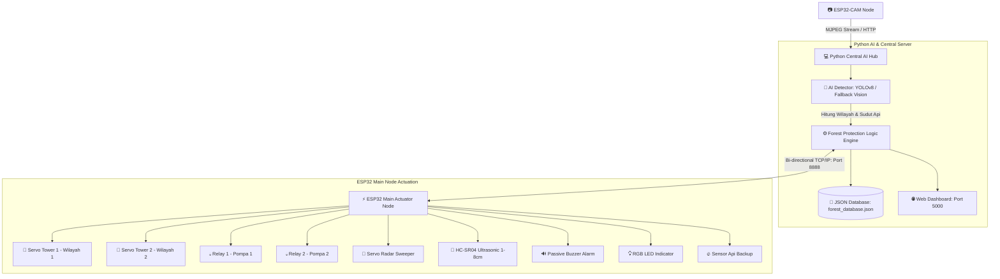

# 🌲 AIoT Intelligence Forest Protection System

Sistem perlindungan hutan terintegrasi berbasis **Artificial Intelligence of Things (AIoT)** menggunakan **ESP32-CAM**, **ESP32 Node**, dan **Python Central Edge Server** melalui protokol **TCP/IP** dan **WebSockets**.

---

## 📌 Fitur Utama Sistem

1. **AI Computer Vision Tracking (ESP32-CAM + Python Engine)**:
   - **Pohon Jatuh Alami**: Deteksi pohon tumbang secara alami $\rightarrow$ Tercatat ke database JSON (`pohon_jatuh_alami` + 1).
   - **Pohon yang Ditebang**: Deteksi pembalakan liar / *illegal logging* $\rightarrow$ Tercatat ke database JSON (`pohon_ditebang` + 1).
   - **Deteksi Titik Api & Lokalisasi Wilayah**:
     - Membagi pandangan kamera menjadi **Wilayah 1** (sisi kiri) dan **Wilayah 2** (sisi kanan).
     - Menghitung koordinat sudut target api ($0^\circ - 180^\circ$).
     - Menggerakkan **Servo Tower Wilayah 1** atau **Servo Tower Wilayah 2** mengarah ke titik api dan mengaktifkan **Relay Pompa** untuk pemadaman otomatis.
     - Mengaktifkan sirine **Passive Buzzer** dan lampu peringatan **RGB LED (Merah)**.
2. **Ultrasonic Radar Sweeper (Servo + HC-SR04)**:
   - Radar menyapu area secara kontinyu ($15^\circ - 165^\circ$).
   - Jika mendeteksi objek intrusi dalam jarak **1 - 8 cm**:
     - Menyalakan **RGB LED** (Kuning/Warning).
     - Membunyikan nada peringatan Buzzer.
     - Menambahkan hitungan ke database JSON (`objek_masuk_ultrasonik` + 1).
3. **Interactive Manual Bounding Box Labeling Tool**:
   - Tool GUI visual berbasis OpenCV untuk *labeling* kotak manual pada dataset training format YOLOv8.
4. **Cyber-Eco Web Dashboard**:
   - Streaming video *live* dengan visualisasi *bounding box*, pembatas wilayah (Zone 1 / Zone 2), dan reticle target.
   - Radar visualizer polar interaktif real-time.
   - Panel kendali manual servo dan relay, indikator hardware, serta histori database JSON.

---

## 📐 Arsitektur Sistem



---

## 🔌 Pin Mapping & Alasan Keamanan Pin ESP32

Pemilihan pin ini **100% aman**, menghindari *strapping pin* (GPIO 0, 2, 4, 12, 15) yang dapat menggagalkan *booting* ESP32 jika terhubung beban saat dinyalakan, serta menghindari GPIO 6-11 (terhubung internal SPI Flash).

| No | Komponen | Pin ESP32 | Tipe GPIO | Alasan & Keamanan Pin |
| :---: | :--- | :---: | :---: | :--- |
| **1** | **Servo Tower 1 (Wilayah 1)** | **GPIO 13** | Output (PWM) | Mengarahkan semprotan air ke titik api di Wilayah 1 (Kiri). Bebas strapping pin. |
| **2** | **Servo Tower 2 (Wilayah 2)** | **GPIO 14** | Output (PWM) | Mengarahkan semprotan air ke titik api di Wilayah 2 (Kanan). Bebas strapping pin. |
| **3** | **Relay 1 (Pompa Wilayah 1)** | **GPIO 25** | Digital Output | Menyalakan pompa pemadam di Wilayah 1. Pin stabil saat boot. |
| **4** | **Relay 2 (Pompa Wilayah 2)** | **GPIO 26** | Digital Output | Menyalakan pompa pemadam di Wilayah 2. Pin stabil saat boot. |
| **5** | **Ultrasonic TRIG** | **GPIO 33** | Digital Output | Output pulsa trigger HC-SR04 (10µs). |
| **6** | **Ultrasonic ECHO** | **GPIO 32** | Digital Input | Input penerima pantulan gelombang HC-SR04. |
| **7** | **Sensor Api (DO Pin)** | **GPIO 35** | Input-Only (GPI) | Pin input murni (tanpa internal pullup), sangat cocok untuk sensor flame DO. |
| **8** | **Passive Buzzer** | **GPIO 18** | Output (PWM/Tone) | Pin PWM audio untuk sirine kebakaran & peringatan jarak dekat. |
| **9** | **LED RGB - Merah (R)** | **GPIO 19** | Digital Output | Indikator Api / Bahaya. |
| **10** | **LED RGB - Hijau (G)** | **GPIO 21** | Digital Output | Indikator Sistem Siaga / Aman. |
| **11** | **LED RGB - Biru (B)** | **GPIO 22** | Digital Output | Indikator Jaringan / Booting. |

> [!IMPORTANT]
> **Catatan Daya (Power Supply)**:
> 2 Servo motor dan 2 Relay memerlukan suplai arus yang stabil. Gunakan **catu daya eksternal 5V (2A)** untuk mensuplai pin VCC Servo dan Relay, serta hubungkan **GND catu daya eksternal bersama dengan GND ESP32 (Common Ground)**.

---

## 🚀 Panduan Menjalankan Sistem

### 1. Instalasi Dependensi Python
Buka terminal pada folder proyek dan jalankan:
```bash
pip install -r requirements.txt
```

### 2. Labeling Dataset Manual (Bounding Box)
Jika ingin menambahkan foto pohon dan api untuk training:
1. Masukkan gambar ke folder `dataset/images/`.
2. Jalankan tool labeling interaktif:
   ```bash
   python python_backend/labeling_tool.py
   ```
   - **Klik & Drag**: Gambar kotak pembatas (*bounding box*).
   - Tekan tombol `1`: Set kelas **Pohon yang ditebang**.
   - Tekan tombol `2`: Set kelas **Pohon jatuh alami**.
   - Tekan tombol `3`: Set kelas **Api**.
   - Tekan `S`: Simpan label YOLO ke `dataset/labels/`.
   - Tekan `N` / `P`: Gambar Selanjutnya / Sebelumnya.

### 3. Training Model YOLOv8 (Opsional)
Setelah dataset siap, latih model dengan:
```bash
python python_backend/train_yolo.py --epochs 40
```
*(Sistem juga sudah dilengkapi **Heuristic Computer Vision Fallback Engine**, sehingga Anda dapat langsung menjalankan dan mendemonstrasikan sistem tanpa harus menunggu proses training).*

### 4. Menjalankan Python Server & Web Dashboard
Jalankan server pusat:
```bash
python python_backend/server.py
```
Buka browser dan akses: **`http://localhost:5000`**

### 5. Upload Firmware ke ESP32 & ESP32-CAM
1. **ESP32-CAM**:
   - Buka file `esp32_cam_firmware/esp32_cam_stream.ino` di Arduino IDE.
   - Sesuaikan `ssid` dan `password` WiFi.
   - Upload dengan memilih board **AI Thinker ESP32-CAM**.
2. **ESP32 Main Actuator Node**:
   - Buka file `esp32_main_firmware/esp32_main_protection.ino` di Arduino IDE.
   - Sesuaikan `ssid`, `password`, dan `python_server_ip` (IP Laptop/Server Anda).
   - Upload dengan memilih board **ESP32 Dev Module**.

---

## 📊 Format Database JSON (`data/forest_database.json`)

```json
{
  "counters": {
    "pohon_jatuh_alami": 3,
    "pohon_ditebang": 1,
    "insiden_api": 2,
    "objek_masuk_ultrasonik": 5
  },
  "events": [
    {
      "id": 1,
      "timestamp": "2026-10-01 13:15:00",
      "type": "API_TERDETEKSI",
      "zone": "Wilayah 1",
      "description": "Api terdeteksi di Wilayah 1 (Angle: 45°, Conf: 92%)",
      "details": {
        "class_id": 2,
        "label": "Api",
        "zone": 1,
        "angle": 45
      }
    }
  ],
  "system_status": {
    "esp32_cam_connected": true,
    "esp32_main_connected": true,
    "fire_extinguish_mode": "AUTO",
    "last_sync": "2026-10-01 13:15:00"
  }
}
```
